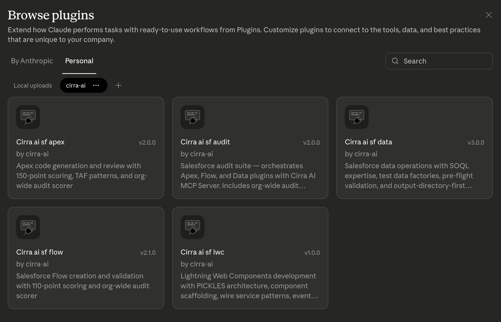
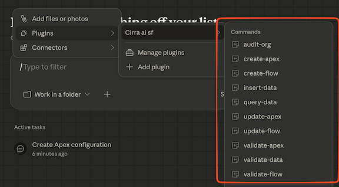

# Cirra AI Salesforce Skills

## Overview

This repository contains a collection of Salesforce admin skills for use with the [Cirra AI MCP Server](https://cirra.ai).

These skills serve two purposes:

- Increase the capabilities of the Cirra AI MCP Server by providing detailed guidance,
  examples and validation scripts

  For example: detailed quality scoring for APEX classes and flows

- Help your AI client perform complex, multi-step and long-running Salesforce admin tasks.

  Instead of entering prompts one at a time, describe an outcome, step away, and come back to finished work — formatted documents, organized files, and more.

Examples:

- 'Generate a comprehensive report of my org and highlight possible improvements'
- 'Audit my APEX, LWC and flows to ensure they meet best practices'
- 'Fix the top priority issues found in the report you just generated'
- 'Generate descriptions and help texts for all the custom fields'
- 'Analyze all my profiles and permission sets and recommend security fixes and cleanup'

These skills work best with the following tools:

- [Claude Cowork](https://support.claude.com/en/articles/10065433-installing-claude-desktop)
- [OpenAI Codex](https://openai.com/codex/)
- Claude in [desktop](https://claude.com/download) or [browser](https://claude.ai/)
- [ChatGPT](https://chatgpt.com/) (partial support)

These tools do not require developer skills (no IDE, CLI, GitHub repo or sfdx project is needed).

However, you can also use the skills with developer-focused tools like [Claude Code](https://code.claude.com/docs/en/overview)
and a growing collection of other [AI development tools](https://agentskills.io/home#adoption)

The following skills are available or planned:

| Skill                                                                           | Description                                                                             |
| ------------------------------------------------------------------------------- | --------------------------------------------------------------------------------------- |
| [cirra-ai-sf-apex](cirra-ai-sf/skills/cirra-ai-sf-apex/README.md)               | Create, update and review Apex classes and triggers                                     |
| [cirra-ai-sf-flow](cirra-ai-sf/skills/cirra-ai-sf-flow/README.md)               | Create, update and review flows. Includes porting from Process Builders                 |
| [cirra-ai-sf-data](cirra-ai-sf/skills/cirra-ai-sf-data/README.md)               | SOQL query building/optimization/execution, DML operations, test data factories         |
| [cirra-ai-sf-lwc](cirra-ai-sf/skills/cirra-ai-sf-lwc/README.md)                 | Lightning Web Components development skill                                              |
| [cirra-ai-sf-metadata](cirra-ai-sf/skills/cirra-ai-sf-metadata/README.md)       | Metadata creation, org queries, permission set generation                               |
| [cirra-ai-sf-permissions](cirra-ai-sf/skills/cirra-ai-sf-permissions/README.md) | Permission Set analysis, hierarchy viewer, "Who has X?" auditing                        |
| [cirra-ai-sf-diagram](cirra-ai-sf/skills/cirra-ai-sf-diagram/README.md)         | Salesforce architecture diagrams (ERDs, OAuth flows, integrations) in Mermaid           |
| [cirra-ai-sf-kugamon](cirra-ai-sf-kugamon/)                                     | Easily create opportunities, orders and quotes with [Kugamon](https://www.kugamon.com/) |

The skills can either be installed individually, or as a bundle. See details for each AI platform below.

To learn more about skills see [What are skills?](https://support.claude.com/en/articles/12512176-what-are-skills)

## Installation

First, sign up for a free trial of the [Cirra AI MCP Server](https://cirra.ai/free-trial/) if you have not already.

Then follow the instructions below for your platform of choice.

### Claude Cowork

To install the plugin that wraps all the Cirra AI skills:

1. Click [here](https://claude.com/product/cowork) to install **Claude Cowork** if you haven't already.
2. Open the Claude Desktop app.
3. Navigate to the Cowork tab.
4. Click “Plugins” in the left sidebar.
5. Click **Personal** and then the **+** icon
6. From the dropdown, select **Add marketplace from GitHub**
7. Enter `cirra-ai/skills` and click **Sync**
8. The end result should look something like this:

   

    

9. You should also see a set of custom commands appear when you hit `/` and navigate to `Plugins/Cirra Ai Sf`

If you prefer to install the plugin or individual skills as zip files, you can download them from https://cirra-ai.github.io/skills/

For more details on **Claude Cowork**, see [Getting started with Cowork](https://support.claude.com/en/articles/13345190-getting-started-with-cowork)

And to learn more about skills in Claude, see https://claude.com/skills

### OpenAI Codex

Install individual skills from https://cirra-ai.github.io/skills/

### Claude web (desktop or browser)

To install individual skill into Claude on the web:

1. Go to [Settings -> Capabilities](https://claude.ai/settings/capabilities)
2. Scroll down to **Skills**
3. Click **+ Add** to add a skill
4. Upload one of the skills zip files found at https://cirra-ai.github.io/skills/

### Claude Code

Claude Code in the desktop app has a Local mode that works very similarly to Claude Cowork.

To install the plugins in the IDE or CLI products, follow the instructions [here](https://code.claude.com/docs/en/discover-plugins).

To install individual skills the steps are [here](https://code.claude.com/docs/en/skills)

The Cirra AI marketplace is `cirra-ai/skills`

## Contributing

We welcome contributions! Please read [CONTRIBUTING.md](./CONTRIBUTING.md) for how to file issues, open pull requests, and run tests locally.

## License

See [LICENSE](LICENSE)

The plugins in this repository are designed for use with Cirra AI, a commercial product developed by Cirra AI, Inc. This repository and its contents are provided independently and are not part of the Cirra AI product itself. Use of Cirra AI is subject to its own separate terms and conditions.
