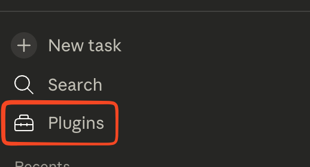
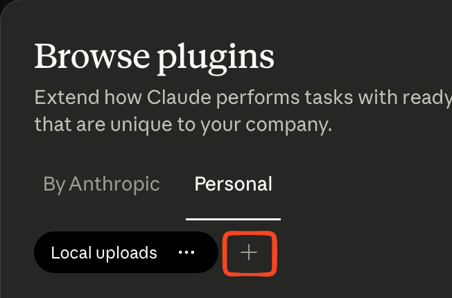

# Cirra AI Salesforce Plugins

[](https://github.com/cirra-ai)


## Overview

This repository contains a collection of Salesforce admin plugins and skills for use with the [Cirra AI MCP Server](https://cirra.ai).

Plugins are ready-made bundles that let you perform complex, time-consuming Salesforce admin tasks from a simple prompt. Each plugin combines skills, connectors, slash commands, and sub-agents into a single package.

https://support.claude.com/en/articles/13345190-getting-started-with-cowork#h_0f9e0998dd

Skills are smaller
https://agentskills.io/what-are-skills

The plugins are specifically designed for non-developers to use with various variations of Claude:

- [Claude Cowork](https://support.claude.com/en/articles/13345190-getting-started-with-cowork) in the [desktop app](https://support.claude.com/en/articles/10065433-installing-claude-desktop)
- Claude Code
  - In the [desktop app](https://code.claude.com/docs/en/desktop-quickstart)
  - In the [browser](https://code.claude.com/docs/en/claude-code-on-the-web) https://claude.ai/code
- Claude chat
  - In the [browser](https://claude.ai)
  - In the [desktop app](https://code.claude.com/docs/en/desktop-quickstart)

The skills should also work with other AI clients that support the [Agent Skills](https://agentskills.io/home) standard.

No developer skills are required, and you don't need an IDE or Salesforce CLI are required.

These plugins were adapted from corresponding skills in the https://github.com/Jaganpro/sf-skills/ repository maintained by Jag Valaiyapathy

## Available Plugins

| Plugin                                | Description                                                                  |
| ------------------------------------- | ---------------------------------------------------------------------------- |
| [cirra-ai-sf](cirra-ai-sf/)           | Orchestrator — coordinates the plugins below into a unified Salesforce suite |
| [cirra-ai-sf-apex](cirra-ai-sf-apex/) | Apex code generation, review, and 150-point scoring                          |
| [cirra-ai-sf-flow](cirra-ai-sf-flow/) | Flow creation, validation, and 110-point scoring                             |
| [cirra-ai-sf-data](cirra-ai-sf-data/) | SOQL queries, DML operations, test data factories, and 130-point validation  |
| [cirra-ai-sf-lwc](cirra-ai-sf-lwc/)   | Lightning Web Components development skill                                   |

More plugins (metadata, SOQL, permissions, Agent Script, and others) will be released incrementally -- stay tuned!

## Installation

### Claude Cowork

1. Make sure you have [Claude Cowork](https://claude.com/product/cowork) installed.
2. Click **Plugins** in the left sidebar

   

   <br/>

3. This opens the **Browse plugins** window

   

   <br/>

4. Click **Personal** and then the **+** icon, and from the dropdown, select **Add marketplace from GitHub**

5. Enter `cirra-ai/skills` and click **Sync**

6. Browse the Cirra AI marketplace and install the plugins you need


Alternatively, download a plugin zip from the [latest release](https://github.com/cirra-ai/skills/releases) and use **Upload plugin** to install it manually.

See the [Cowork plugins docs](https://support.claude.com/en/articles/13345190-getting-started-with-cowork#h_0f9e0998dd) for more details.

For mroe details, see:

- [Getting started with Cowork](https://support.claude.com/en/articles/13345190-getting-started-with-cowork)
- [Claude Code](https://code.claude.com/docs)
- [Discover plugins](https://code.claude.com/docs/en/discover-plugins)

### Claude Code

First, make sure you have [Claude Code](https://claude.com/product/claude-code) installed.

See the [Claude Code plugins docs](https://docs.anthropic.com/en/docs/claude-code/plugins) for general setup, then:

```bash
# Add the marketplace (one-time)
/plugin marketplace add cirra-ai/skills

# Install the complete suite
/plugin install cirra-ai-sf-skills@cirra-ai

# Or install individual plugins
/plugin install cirra-ai-sf-apex@cirra-ai
```

## Requirements

- Cirra AI MCP Server
- Target Salesforce org (sandbox or production)
- [Claude Cowork](https://claude.com/product/cowork) or [Claude Code](https://claude.com/product/claude-code)

## Contributing

We welcome contributions! Please read [.github/CONTRIBUTING.md](.github/CONTRIBUTING.md) for how to file issues, open pull requests, and run tests locally.

## License

See [LICENSE](LICENSE)

The plugins in this repository are designed for use with Cirra AI, a commercial product developed by Cirra AI, Inc. This repository and its contents are provided independently and are not part of the Cirra AI product itself. Use of Cirra AI is subject to its own separate terms and conditions.
